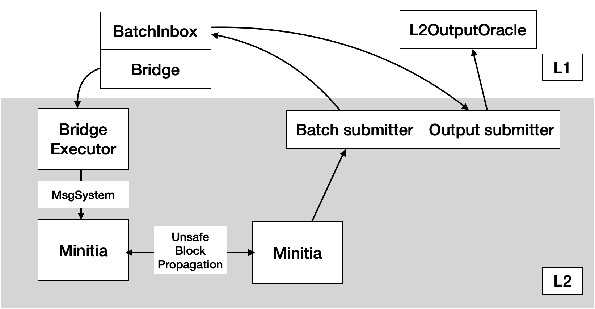

# OPinit CosmosSDK Modules

Initia Layer 2 solution with Optimistic Rollup.

## Optimistic Rollup Architecture

### L1 Components

#### [Bridge Module](./specs/l1_bridge.md)

The bridge module triggers a deposit event for the bridge executor, which acts as a relayer between L1 and L2. It has two interfaces: `initialize_deposit` for users and `finalize_withdrawal` for the bridge executor. Both interfaces can be executed by anyone who wants to move the tokens between L1 and L2.

A deposit does not require any proving or confirmation period, but a withdrawal requires [withdrawal proving](./specs/withdrawal_proving.md) and a finalized output root which contains the withdrawal transaction.

#### BatchInbox Module

The batch inbox is the data availability (DA) layer, which can be replaced by other solutions like `Celestia`. The rollup chain can be deterministically derived using the data from the DA layer. This ability to derive the entire rollup chain based on the DA layer is what makes Minitia a rollup.

To reduce gas costs, the batch inbox only exposes an empty function interface that receives arbitrary bytes as an argument. This trick ensures that L2 data is not a part of the state but instead resides in tx db (= calldata).

#### [L2OutputOracle Module](./specs/l2_output_oracle.md)

The L2 output oracle is the component to store the L2 output root for block finalization. The users who withdraw the tokens from L2 to L1 also need to use this output root to prove the withdraw transaction is in the finalized L2 output root.

The challenger always monitor the oracle output and do challenge when the output is different from the value computed from challenger side.

### L2 Components

#### BridgeExecutor

The bridge executor is the core component in minitia rollup, which is charge of following operations via [L2 Bridge Module](./specs/l2_bridge.md):

* Finalize L1 deposit transaction to L2.
* Construct withdraw tx storage Merkle Tree.
* Compute L2 output root.
* Provide the withdrawal proofs (Merkle Proofs) to users.

#### [Minitia](./specs/minitia.md)

The L2 app chain implementation provides rollup-specific interfaces for a bridge executor. The minitia is a minimized version of the initia app chain, so it does not include staking-related modules such as `staking`, `distribution`, `crisis`, and `evidence`. Instead, it has a new module called `opchild`, which provides a permissioned interface for adding and removing validators, as well as executing [bridge messages](./specs/l2_bridge.md) that can be executed by the bridge executor.

#### BatchSubmitter

A background process that submits transaction batches to the `BatchInbox` module of L1.

#### Challenger

A challenger is an entity capable of deleting invalid output proposals from the output oracle. It mimics the output root generation process that a bridge executor does to check the validity of the proposed output root on the oracle module. This process confirms that the proposed output root contains a valid app hash, and all withdrawal transactions are properly relayed to L1.

Additionally, a challenger monitors deposit transactions from L1 to L2 to ensure censorship resistance. If the transactions are not properly relayed to L2 within the timeout (L2 block numbers), the challenger deletes the output root.

In the initia optimistic rollup spec, a challenger is supposed to run an IBC relayer between L1 and L2 to support instant bridge operation. It is the entity that can monitor an invalid state first, so it can prevent invalid IBC operation by stopping the relayer process. To accomplish this, initia is using [a new ibc middleware](https://github.com/initia-labs/initia/pull/86) on the L1 side to restrict the relayer permission to a specific address for each channel.

### Dispute Process

Initia's optimistic rollup uses a simplified version of the dispute mechanism with L1 governance security. This approach is very similar to Cosmos's shared security, but it does not require all validators to run a whole L2 node. Instead, the validators are only required to run an L2 node to decide the valid entity between the `proposer` and `challenger` when a dispute is opened. They do not need to run whole L2 blocks but only need to run a dispute block with the last L2 state on L1.

The dispute process works as follows:

1. A `challenger` deletes the invalid output root from the output oracle module.
2. Both a `challenger` and a `proposer` make a governance proposal to update invalid operator addresses:
    * The `challenger` makes a governance proposal to change the `proposer` to another address if the `proposer` keeps submitting an invalid output root.
    * The `proposer` makes a governance proposal to change the `challenger` to another address if the `challenger` keeps deleting a valid output root.
3. L1 validators make a validity decision by running an L2 node with L2 state and data inputs.
