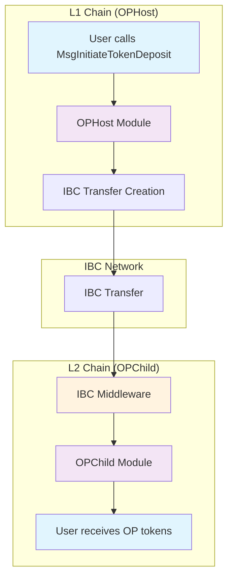
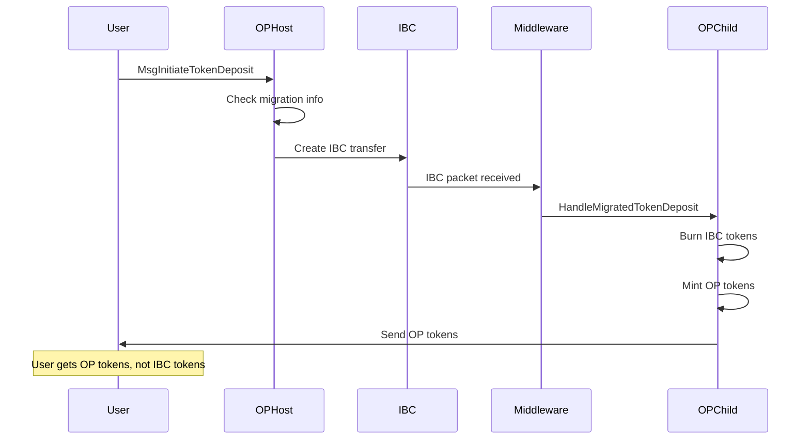
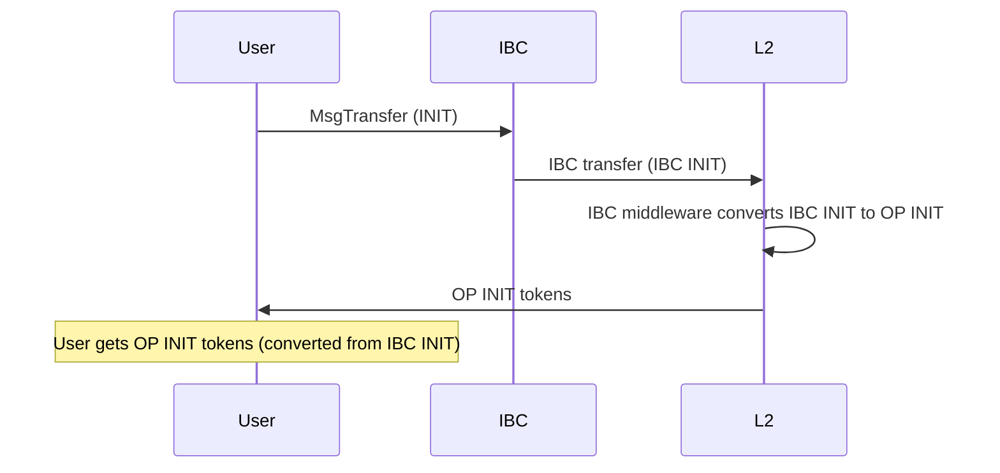
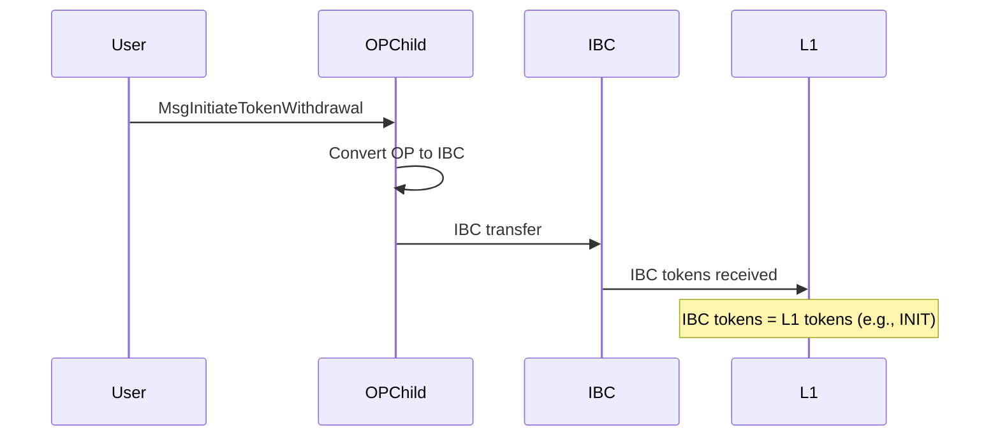
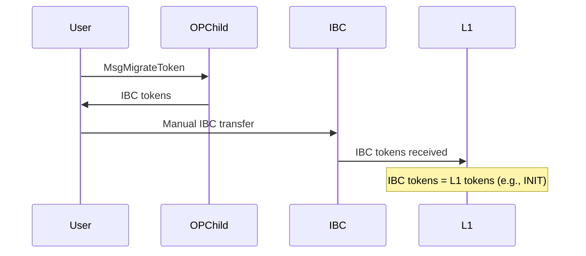
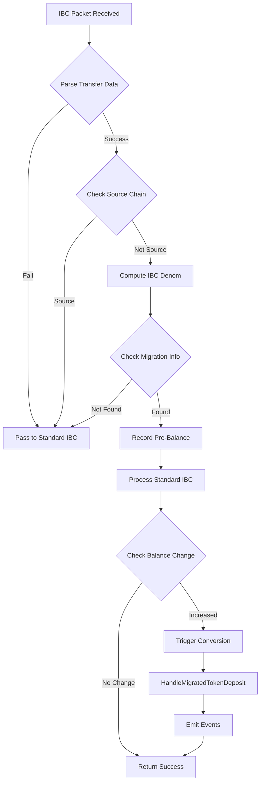
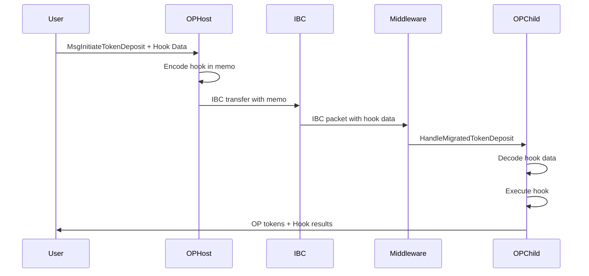
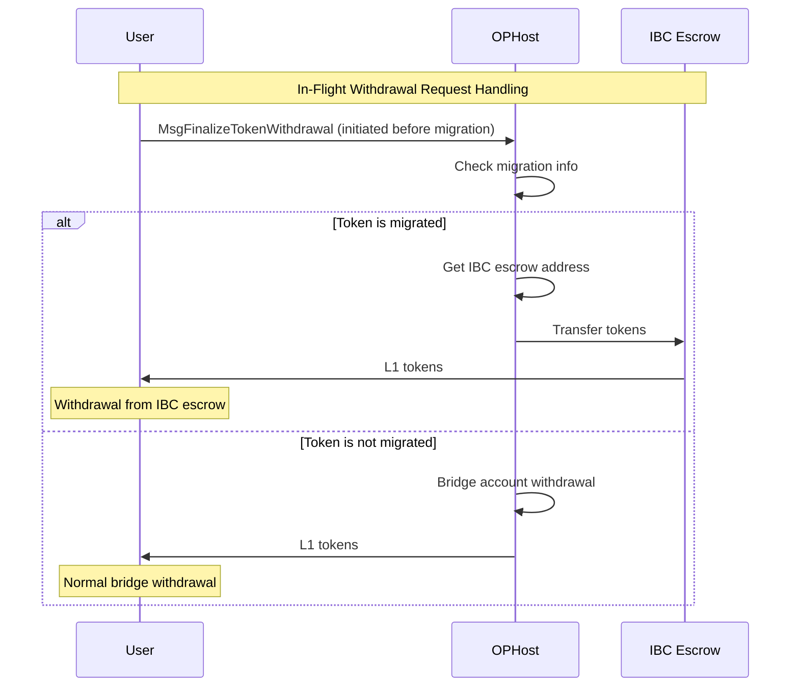

# Bridge Replacement System Flow Diagrams

## Overview

This document provides visual representations of the bridge replacement system flows, showing how the system transitions from OP Bridge to IBC Bridge while preserving user experience.

## System Architecture Diagram

## Bridge Replacement Flow

### L1 → L2 Flow (Two Options)

#### Option A: Bridge Replacement (User Experience Preserved)

#### Option B: Normal IBC Bridge

### L2 → L1 Flow (Two Options)

#### Option A: Automatic Migration

#### Option B: Explicit Migration

## IBC Middleware Integration

### Packet Interception Flow

## Bridge Hook Preservation Flow

## In-Flight Withdrawal Handling on OPHost (Initiated Before Migration)

